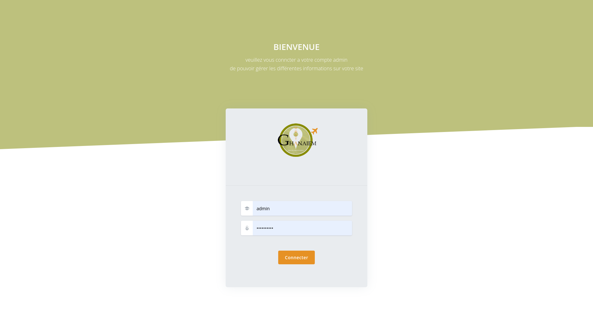

# Agency

## Description:
Mostaghanaiem is a web plateforme for travel agency made with Django Framework, it contains a CRUD managment for an agency details and all its rubrics and a reservation managment using the sqlite database.

## Screenshots:
### A Bootstrap 5 UI:

### Login UI:

### Dashboard UI:

### Dashboard Info UI:

## TODO:
- [ ] Switch from local Database to something more powerful (AWS S3 bucket).
- [ ] Minimize the Media Files size.
- [ ] ADD JS lazyload library for images and big size media.
- [ ] Add Auto Delete for old reservations and old trips announces to save Spaces on the database. 

## Tools & languages:    
* Visual Studio Code (IDE).
* Python (Logic code).
* Django template language (DTL) (UI Library).
* HTML & CSS & BOOTSTRAP(UI Design).

## How to use: 
 #### A stable release will be uploaded after completing the Todo tasks.
 * Fork, clone or download the project and open it with VsCode (or any other IDE).
 * cd ghanaiem_agency/
 * create Virtual envirenment 'virtualenv <name_it_as_you_want> .'.
 * Activate it on Linux:'source <name_of_the_envirement>/bin/activate'.
 * Activate it on Windows:'source <name_of_the_envirement>/Scripts/activate'.
 * Install the requirement libraries 'pip install -r requirements.txt'.
 * Run the server  'python manage.py runserver'.

